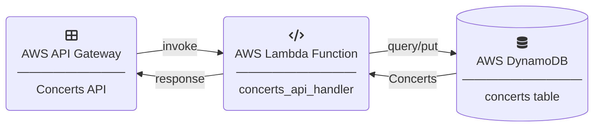
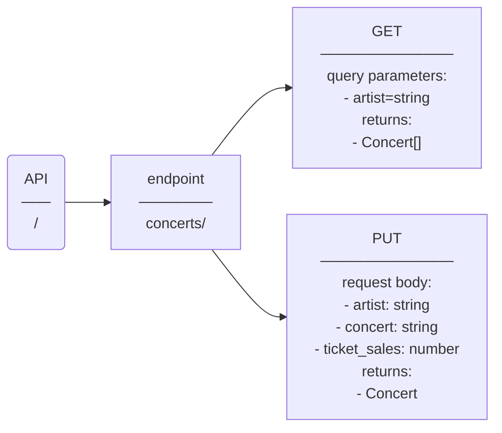
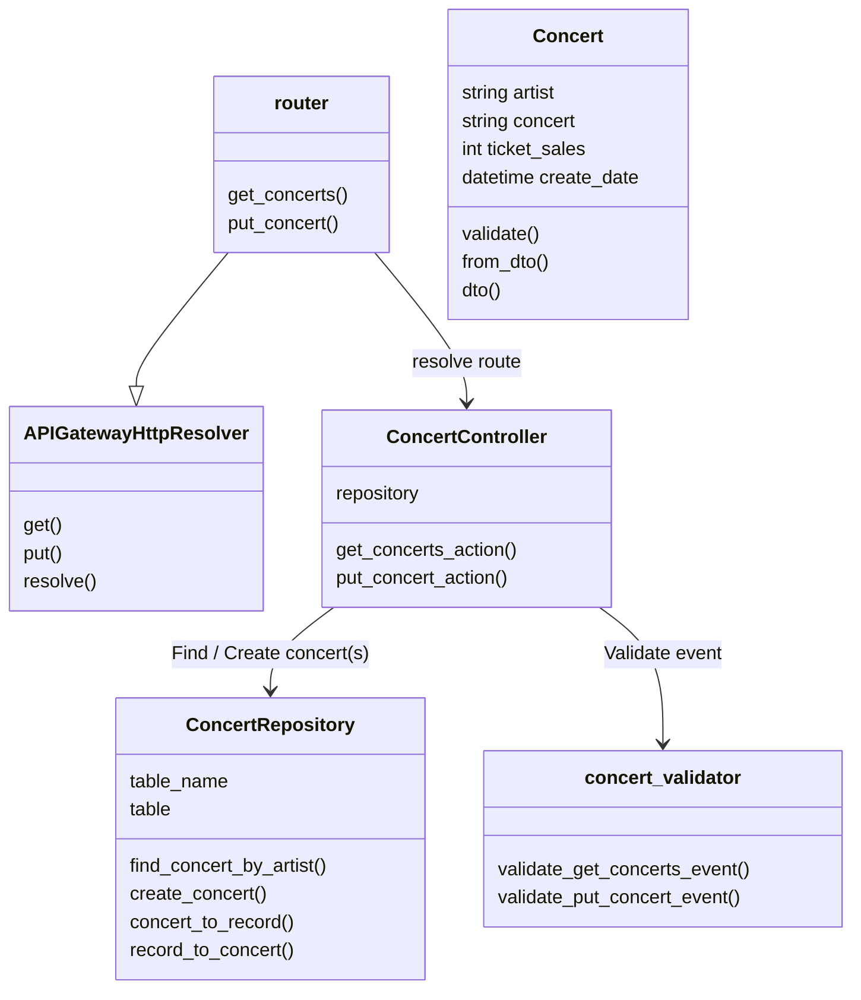
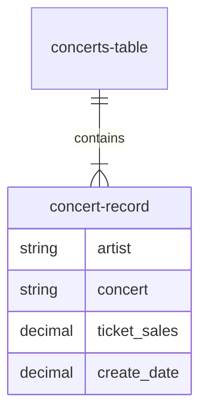

# Lab.AWS.API-Gateway

A basic serverless API with AWS API Gateway, OpenAPI 3.0, AWS Lambda, Lambda Powertools for Python, AWS DynamoDB and AWS SAM.

* [AWS API Gateway](https://docs.aws.amazon.com/apigateway/latest/developerguide/welcome.html)
* [OpenAPI 3.0](https://docs.aws.amazon.com/apigateway/latest/developerguide/api-gateway-swagger-extensions.html)
* [AWS Lambda](https://docs.aws.amazon.com/lambda/latest/dg/welcome.html)
* [Python Powertools for AWS Lambda](https://docs.powertools.aws.dev/lambda/python/latest/)
* [AWS DynamoDB](https://docs.aws.amazon.com/amazondynamodb/latest/developerguide/Introduction.html)
* [AWS Serverless Application Model (SAM)](https://aws.amazon.com/serverless/sam/)


API Handler clean code practices:

* **MVC pattern** - https://python.plainenglish.io/model-view-controller-mvc-pattern-in-python-a-beginners-guide-b0d9855068eb
* **Repository pattern** - https://medium.com/@pererikbergman/repository-design-pattern-e28c0f3e4a30
* **Validators**
* **Router**


## Architecture

<!-- Edit: https://mermaid.live/ -->


### API




### Handler



### Database




## Development

### Dependencies

1. Install latest AWS CLI https://docs.aws.amazon.com/cli/latest/userguide/getting-started-version.html
2. Install AWS SAM CLI https://docs.aws.amazon.com/serverless-application-model/latest/developerguide/install-sam-cli.html
3. Install Python 3.9


### Recommended Visual Studio Code plugins

* https://marketplace.visualstudio.com/items?itemName=tamasfe.even-better-toml
* https://marketplace.visualstudio.com/items?itemName=redhat.vscode-yaml
* https://marketplace.visualstudio.com/items?itemName=yzhang.markdown-all-in-one


## Deployment

For instructions regarding SAM, see https://docs.aws.amazon.com/serverless-application-model/latest/developerguide/using-sam-cli.html.

### SAM deployment

```sh
cd src
```

```sh
# Build & deploy
sam build
sam deploy --config-env dev
```

```sh
# Develop interactively
sam sync --stack-name concerts-api-dev --watch
```

```sh
# Stack outputs
sam list stack-outputs --stack-name concerts-api-dev
```

### Cleanup

```sh
# Delete stack
sam delete --config-env dev
# or
aws cloudformation delete-stack --stack-name concerts-api-dev
# To remove all SAM resources completely, also the stack aws-sam-cli-managed-default needs to be deleted
aws cloudformation delete-stack --stack-name aws-sam-cli-managed-default
```

## Try it out

### Create a concert

```sh
# Replace API_ID by the actual ID
curl -X PUT --location 'https://{API_ID}.execute-api.eu-central-1.amazonaws.com/dev/concerts' \
    -H 'Content-Type: application/json' \
    -d '{"artist":"Madonna","concert":"This is Madonna 2023","ticket_sales": 5000000 }'
```

### List concerts

Open [https://{API_ID}.execute-api.eu-central-1.amazonaws.com/dev/concerts?artist=Madonna](https://{API_ID}.execute-api.eu-central-1.amazonaws.com/dev/concerts?artist=Madonna) in your browser (replace API_ID by the actual ID)


## Additional Resources

* Python doc comments with Sphinx: https://www.sphinx-doc.org/en/master/usage/restructuredtext/domains.html#python-signatures
