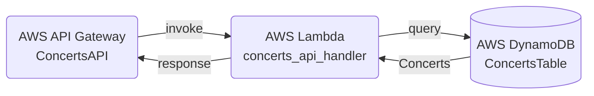
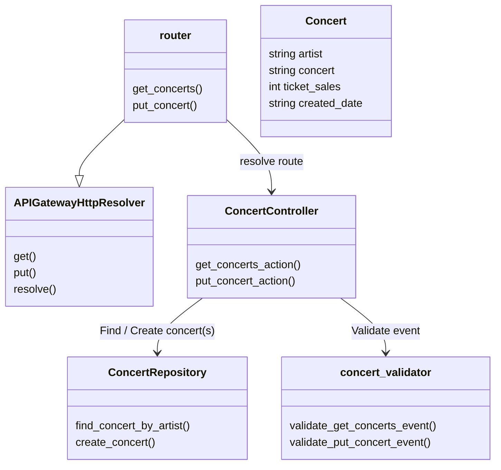

# Lab.AWS.API-Gateway

A basic API Gateway example with Lambda Powertools router:



* OpenAPI 3.0 template
* [Lambda Powertools for Python](https://docs.powertools.aws.dev/lambda/python/latest/core/event_handler/api_gateway/)
* Modular handler Lambda:
    * Request router (Powertools APIGatewayHttpResolver): [index.py](./src/lambda/concerts_api_handler/index.py)
    * Controller: [controller/concerts_controller.py](./src/lambda/concerts_api_handler/src/controller/concerts_controller.py)
    * Model: [model/concert.py](./src/lambda/concerts_api_handler/src/model/concert.py)
    * Repository: [repository/concerts_repository.py](./src/lambda/concerts_api_handler/src/repository/concerts_repository.py)
* Logging: Powertools logger
* Tracing: Powertools tracer




## Development

### Dependencies

1. Install latest AWS CLI https://docs.aws.amazon.com/cli/latest/userguide/getting-started-version.html
2. Install AWS SAM CLI https://docs.aws.amazon.com/serverless-application-model/latest/developerguide/install-sam-cli.html
3. Install Python 3.9


### Recommended Visual Studio Code plugins

* https://marketplace.visualstudio.com/items?itemName=tamasfe.even-better-toml
* https://marketplace.visualstudio.com/items?itemName=redhat.vscode-yaml
* https://marketplace.visualstudio.com/items?itemName=yzhang.markdown-all-in-one


## Deployment

https://docs.aws.amazon.com/serverless-application-model/latest/developerguide/using-sam-cli.html

```sh
cd src
```

```sh
# Build & deploy
sam build
sam deploy --config-env dev
```

```sh
# Develop interactively
sam sync --stack-name concerts-api-dev --watch
```

```sh
# Stack outputs
sam list stack-outputs --stack-name concerts-api-dev
```

```sh
# Delete stack
sam delete --config-env dev
# or
aws cloudformation delete-stack --stack-name concerts-api-dev
# To remove all SAM resources completely, als the stack aws-sam-cli-managed-default needs to be deleted
aws cloudformation delete-stack --stack-name aws-sam-cli-managed-default
```

## Resources

* Python doc comments with Sphinx: https://www.sphinx-doc.org/en/master/usage/restructuredtext/domains.html#python-signatures


## Try it out

### Create a concert

```sh
# Replace API_ID by the actual ID
curl -X PUT --location 'https://{API_ID}.execute-api.eu-central-1.amazonaws.com/dev/concerts' \
    -H 'Content-Type: application/json' \
    -d '{"artist":"Madonna","concert":"This is Madonna 2023","ticket_sales": 5000000 }'
```

### List concerts

Open [https://{API_ID}.execute-api.eu-central-1.amazonaws.com/dev/concerts?artist=Madonna](https://{API_ID}.execute-api.eu-central-1.amazonaws.com/dev/concerts?artist=Madonna) in your browser (replace API_ID by the actual ID)
