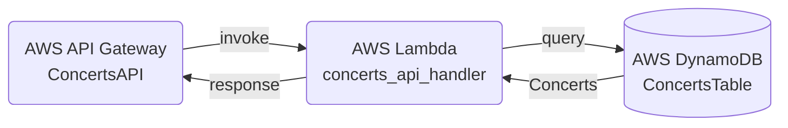
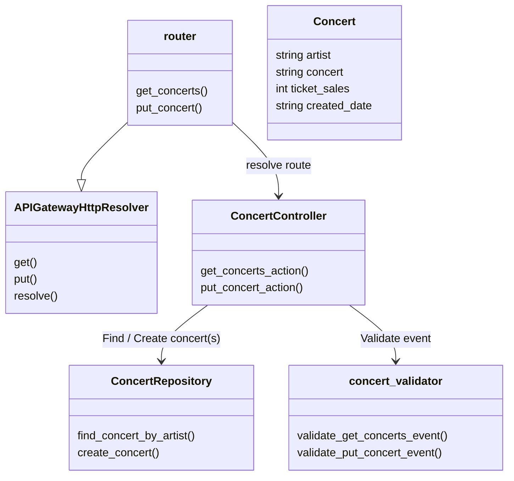

# Lab.AWS.API-Gateway

**Creating a serverless API using AWS SAM, OpenAPI 3.0 and Lambda Powertools - writing clean Code with Python**

"Work smart, not hard" means using the best tools for the job. Developers also say "be lazy, write less code".
Serverless technology does not only allow to outsource server and network maintenance and focus on the application, it also allows to focus on cleaner code.

This article brings together several tweeks of the serverless world of the last years:

* AWS Serverless Application Model (SAM) - [An open-source framework for building serverless applications](https://aws.amazon.com/serverless/sam/)
* OpenAPI 3.0 - [An open-source API definition language supported by AWS API Gateway](https://docs.aws.amazon.com/apigateway/latest/developerguide/api-gateway-swagger-extensions.html)
* Powertools for AWS Lambda - [A developer toolkit to implement Serverless best practices and increase developer velocity](https://docs.powertools.aws.dev/lambda/python/latest/)

It puts also a strong focus on clean code:

* MVC pattern - https://python.plainenglish.io/model-view-controller-mvc-pattern-in-python-a-beginners-guide-b0d9855068eb
* Repository pattern - https://medium.com/@pererikbergman/repository-design-pattern-e28c0f3e4a30
* Validators
* Router

## High level architecture

A basic API Gateway setup with Lambda Powertools consists of:

* The actual API (AWS API Gateway), which offers the REST API
* The handler (AWS Lambda), which processes the requests
* A table (AWS DynamoDB), where the data is stored

<!-- Edit: https://mermaid.live/ -->


## Implementation details

### The API Gateway - The entrypoint

The OpenAPI 3.0 specification allows us, to define an API in an opensource format and deploy the API Gateway based on it. Furthermore we could generate a Swagger page, based on it.

For each endpoint, a "path" needs to be defined:

```yaml
paths:
  /concerts:
    get:
      description: Returns a list of concerts
      parameters:
        - in: query
          name: artist
          schema:
            type: string
          description: Artist to filter the concerts
      responses:
        200:
          description: Successfully retrieved concerts
```

For the integration with Lambda, AWS offers a proxy integration:

```yaml
      x-amazon-apigateway-integration:
        httpMethod: POST
        payloadFormatVersion: "2.0"
        timeoutInMillis: 10000
        passthroughBehavior: "when_no_match"
        type: aws_proxy
        uri:
          Fn::Sub: "arn:aws:apigateway:${AWS::Region}:lambda:path/2015-03-31/functions/${ApiHandlerFunction.Arn}/invocations"
```


### The API handler Lambda function - The worker

* Modular handler Lambda:
    * Request router (Powertools APIGatewayHttpResolver): [index.py](./src/lambda/concerts_api_handler/index.py)
    * Controller: [controller/concerts_controller.py](./src/lambda/concerts_api_handler/src/controller/concerts_controller.py)
    * Model: [model/concert.py](./src/lambda/concerts_api_handler/src/model/concert.py)
    * Repository: [repository/concerts_repository.py](./src/lambda/concerts_api_handler/src/repository/concerts_repository.py)
* Logging: Powertools logger
* Tracing: Powertools tracer

<!-- Edit: https://mermaid.live/ -->



## Development

### Dependencies

1. Install latest AWS CLI https://docs.aws.amazon.com/cli/latest/userguide/getting-started-version.html
2. Install AWS SAM CLI https://docs.aws.amazon.com/serverless-application-model/latest/developerguide/install-sam-cli.html
3. Install Python 3.9


### Recommended Visual Studio Code plugins

* https://marketplace.visualstudio.com/items?itemName=tamasfe.even-better-toml
* https://marketplace.visualstudio.com/items?itemName=redhat.vscode-yaml
* https://marketplace.visualstudio.com/items?itemName=yzhang.markdown-all-in-one


## Deployment

https://docs.aws.amazon.com/serverless-application-model/latest/developerguide/using-sam-cli.html

```sh
cd src
```

```sh
# Build & deploy
sam build
sam deploy --config-env dev
```

```sh
# Develop interactively
sam sync --stack-name concerts-api-dev --watch
```

```sh
# Stack outputs
sam list stack-outputs --stack-name concerts-api-dev
```

```sh
# Delete stack
sam delete --config-env dev
# or
aws cloudformation delete-stack --stack-name concerts-api-dev
# To remove all SAM resources completely, als the stack aws-sam-cli-managed-default needs to be deleted
aws cloudformation delete-stack --stack-name aws-sam-cli-managed-default
```

## Resources

* Python doc comments with Sphinx: https://www.sphinx-doc.org/en/master/usage/restructuredtext/domains.html#python-signatures


## Try it out

### Create a concert

```sh
# Replace API_ID by the actual ID
curl -X PUT --location 'https://{API_ID}.execute-api.eu-central-1.amazonaws.com/dev/concerts' \
    -H 'Content-Type: application/json' \
    -d '{"artist":"Madonna","concert":"This is Madonna 2023","ticket_sales": 5000000 }'
```

### List concerts

Open [https://{API_ID}.execute-api.eu-central-1.amazonaws.com/dev/concerts?artist=Madonna](https://{API_ID}.execute-api.eu-central-1.amazonaws.com/dev/concerts?artist=Madonna) in your browser (replace API_ID by the actual ID)
